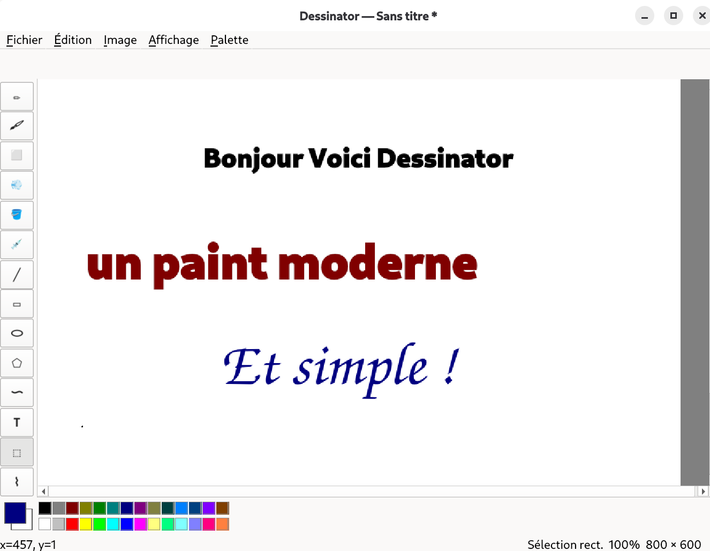

# 🎨 Dessinator

<div align="center">


**Un outil de dessin moderne inspiré de Microsoft Paint, écrit en Python 3 avec PyQt6.**  
Léger, rapide, open-source — taillé pour Linux. ✂️🖌️



</div>

---

## ✨ Fonctionnalités

### 🖊️ Outils de dessin
| Outil | Description |
|-------|-------------|
| ✏️ **Crayon** | Tracé précis pixel par pixel (algorithme de Bresenham) |
| 🖌️ **Pinceau** | Rond ou carré, 4 tailles disponibles |
| 🧹 **Gomme** | Efface vers la couleur d'arrière-plan |
| 💨 **Aérographe** | Effet spray avec diffusion aléatoire |
| 🪣 **Remplissage** | Flood fill par scanline |
| 💉 **Pipette** | Capture une couleur depuis le canvas |

### 📐 Formes
- **Ligne**, **Rectangle**, **Ellipse**
- **Polygone** — clic pour chaque sommet, double-clic pour fermer
- **Courbe de Bézier** — cliquer-glisser puis clic pour le point de contrôle
- **Texte** — insertion rasterisée avec sélection de police

### 🖱️ Sélection & Édition
- ⬚ Sélection rectangulaire
- ⌇ Sélection libre (lasso)
- Copier / Couper / Coller / Supprimer
- **Coller depuis le presse-papier système** (screenshots via `Ctrl+V`) 🆕

### 🔍 Affichage
- Zoom de **10% à 800%**
- Grille pixel visible à partir de ×4 (`Ctrl+G`)
- 3 niveaux d'annulation (`Ctrl+Z` / `Ctrl+Y`)

### 🎨 Palette & Formats
- 28 couleurs style Paint 95
- Palette personnalisable et sauvegardable en JSON
- Lecture/écriture **PNG** et **JPEG** (via Pillow)
- Opérations image : inverser les couleurs, retourner (H/V), redimensionner

---

## 🚀 Installation

### Prérequis
- Python 3.11+
- Linux (Debian/Ubuntu recommandé)

### Étapes

```bash
# 1. Cloner le dépôt
git clone https://github.com/nouhailler/Dessinator.git
cd Dessinator

# 2. Créer un environnement virtuel
python3 -m venv venv
source venv/bin/activate

# 3. Installer les dépendances
pip install -r requirements.txt

# 4. Lancer l'application
python main.py
```

### Dépendances

| Paquet | Rôle | Version |
|--------|------|---------|
| `PyQt6` | Interface graphique Qt 6 | ≥ 6.4 |
| `Pillow` | Lecture/écriture PNG & JPEG | ≥ 10.0 |
| `numpy` | Performances (optionnel) | ≥ 1.24 |

> 💡 **Tip Debian** : Si `pip` se plaint de l'environnement géré par apt, utilisez bien le venv comme indiqué ci-dessus.

---

## ⌨️ Raccourcis clavier

### Fichier & Édition
| Action | Raccourci |
|--------|-----------|
| Nouveau | `Ctrl+N` |
| Ouvrir | `Ctrl+O` |
| Enregistrer | `Ctrl+S` |
| Enregistrer sous | `Ctrl+Shift+S` |
| Annuler | `Ctrl+Z` |
| Rétablir | `Ctrl+Y` |
| Copier | `Ctrl+C` |
| Couper | `Ctrl+X` |
| Coller | `Ctrl+V` |
| Tout sélectionner | `Ctrl+A` |
| Quitter | `Ctrl+Q` |

### Affichage
| Action | Raccourci |
|--------|-----------|
| Zoom + | `Ctrl++` |
| Zoom - | `Ctrl+-` |
| Zoom 100% | `Ctrl+0` |
| Grille pixel | `Ctrl+G` |

### Sélection rapide d'outil
| Touche | Outil |
|--------|-------|
| `P` | Crayon |
| `B` | Pinceau |
| `E` | Gomme |
| `A` | Aérographe |
| `F` | Remplissage |
| `I` | Pipette |
| `L` | Ligne |
| `R` | Rectangle |
| `O` | Ellipse |
| `G` | Polygone |
| `U` | Courbe |
| `X` | Texte |
| `S` | Sélection rect. |
| `W` | Sélection libre |

---

## 🏗️ Architecture

```
Dessinator/
├── main.py                      # Point d'entrée
└── paint95/
    ├── main.py                  # Initialisation Qt
    ├── ui/
    │   ├── main_window.py       # Fenêtre principale + menus
    │   ├── toolbar.py           # Barre d'outils verticale
    │   ├── palette.py           # Palette de couleurs
    │   └── statusbar.py         # Barre d'état (outil, zoom, curseur)
    ├── canvas/
    │   ├── canvas_widget.py     # Widget de dessin (zoom, grille, événements)
    │   ├── drawing_engine.py    # Moteur de dessin + buffer QImage
    │   └── selection_manager.py # Gestion des sélections (rect & lasso)
    ├── tools/
    │   ├── base.py              # Classe abstraite BaseTool
    │   ├── pencil.py            # Crayon (Bresenham)
    │   ├── brush.py             # Pinceau
    │   ├── eraser.py            # Gomme
    │   ├── spray.py             # Aérographe
    │   ├── fill.py              # Seau (scanline flood fill)
    │   ├── pipette.py           # Pipette couleur
    │   └── shapes.py            # Ligne, Rectangle, Ellipse, Polygone, Courbe, Texte
    ├── io/
    │   ├── image_loader.py      # Chargement PNG/JPEG via Pillow
    │   └── image_saver.py       # Sauvegarde PNG/JPEG via Pillow
    ├── color/
    │   ├── palette_manager.py   # Gestion palette + persistance JSON
    │   └── color_dialog.py      # Sélecteur de couleur
    └── history/
        └── undo_manager.py      # Pile circulaire d'annulation (3 niveaux)
```

---

## 📊 Performances

- 🖼️ Canvas jusqu'à **4096×4096 px**
- ⚡ Dessin fluide à **60 FPS** (visé)
- 💾 Consommation mémoire **< 200 MB** pour un canvas standard

---

## 🤝 Contribuer

Les contributions sont les bienvenues ! N'hésitez pas à ouvrir une issue ou une pull request.

---

## 📄 Licence

Ce projet est sous licence **MIT** — voir le fichier [LICENSE](LICENSE) pour les détails.

---

<div align="center">

Fait avec ❤️ pour Linux

</div>
